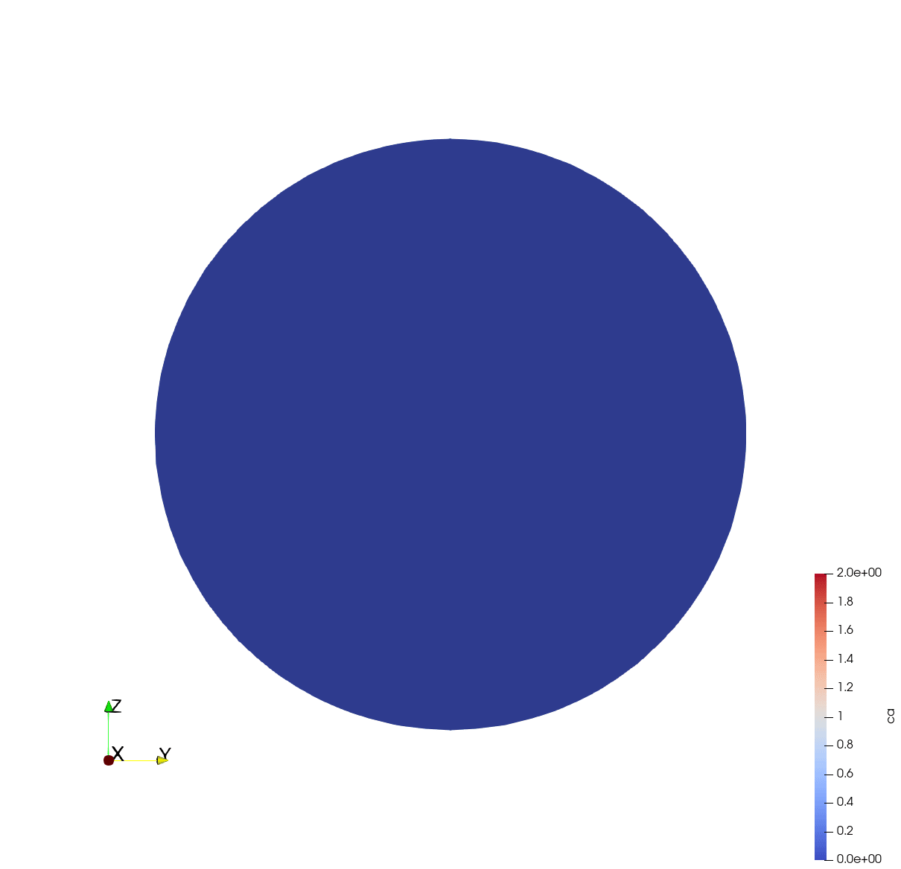

# Biomechanical and Biochemical Simulator (BMBC-Sim)
:construction: **Note:** This project is still in active development. Expect incomplete features and breaking changes. :construction:

The Biomechanical and Biochemical Simulator (BMBC-Sim) is a multi-physics simulation framework for simulating coupled mechanical and chemical processes in biological models using [NGSolve](https://ngsolve.org/).
It is designed to easily prototype hypotheses, reproduce literature scenarios, or explore custom geometries with tightly coupled mechanical and chemical dynamics.

## Quick Start
```bash
uv sync                        # create the development environment
uv run python scripts/demo.py  # run a demo simulation
```

BMBC-Sim relies on [uv](https://docs.astral.sh/uv/) for reproducible environments. Once `uv sync` completes, the virtual environment is available in your IDE.

## Working With Simulations
Setting up a simulation is straightforward as BMBC-Sim provides an easy-to-use API for defining geometries, species, diffusion, reactions, and more.
```python
import astropy.units as u
import bmbcsim
import bmbcsim.simulation.transport as transport

# Create a spherical mesh with a radius of 10 micrometers and a mesh size of 1 micrometer
mesh = bmbcsim.geometry.create_sphere_geometry(radius=10 * u.um, mesh_size=1 * u.um)
sim = bmbcsim.Simulation("demo", mesh, result_root="results")

# Access the compartment named "sphere" from the simulation geometry
# and add species that can diffuse and react within it
cell = sim.simulation_geometry.compartments["sphere"]
ca = sim.add_species("ca")
buffer = sim.add_species("buffer")
ca_buffer = sim.add_species("ca_buffer")

# Initialize the buffer with a concentration of 1 millimolar
cell.initialize_species(buffer, value=1 * u.mmol / u.l)

# Add diffusion constants on a per-species and per-compartment basis
cell.add_diffusion(ca, diffusivity=0.2 * u.um**2 / u.ms)
cell.add_diffusion(buffer, diffusivity=0.1 * u.um**2 / u.ms)
cell.add_diffusion(ca_buffer, diffusivity=0.05 * u.um**2 / u.ms)

# Add reaction Ca + Buffer <-> CaBuffer with forward and reverse rate constants
cell.add_reaction(
    reactants=[ca, buffer], products=[ca_buffer],
    k_f=0.1 / (u.ms * u.um**3), k_r=0.05 / u.ms,
)

# Add influx of calcium at the boundary of the sphere with a rate of
# 0.2 millimolar per millisecond for the first 5 milliseconds
membrane = sim.simulation_geometry.membranes["boundary"]
buffer_substance = 1 * u.mmol / u.l * cell.volume
flux = lambda t: buffer_substance / (5 * u.ms) if t < 5 * u.ms else 0 * u.mmol / u.ms
membrane.add_transport(ca, transport.GeneralFlux(flux=flux), source=None, target=cell)

# Run the simulation for 10 milliseconds with a time step of 0.1 milliseconds
# recording a snapshot of all species every 1 millisecond
sim.run(end_time=10.0 * u.ms, time_step=0.1 * u.ms, record_interval=1.0 * u.ms)
```
This runs a simple reaction-diffusion simulation in a spherical cell and stores the results in the `results/demo_<timestamp>` folder.
The `ResultLoader` API then lets you post-process outputs into pandas/xarray structures.
All results are saved as VTK files for easy visualization in [Paraview](https://www.paraview.org/) or similar tools.

This should give you an output like this:


## Repository Structure
- `src/bmbcsim/` – core simulation engine, geometry builders, and utilities.
- `scripts/` – curated scenarios (Paszek, Sala, Tour, and more) ready to run.
- `scripts/tutorials/` – bite-sized notebooks and scripts that demonstrate specific techniques (point sampling, tortuosity, deformation, etc.).
- `test/` – pytest suite covering units, multi-compartment setups, electrostatics, and geometry validation.
